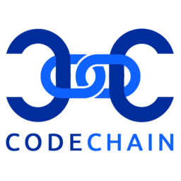

Codechain — code trust through hash chains
------------------------------------------



[](https://godoc.org/github.com/frankbraun/codechain) [](https://travis-ci.org/frankbraun/codechain) [](https://goreportcard.com/report/github.com/frankbraun/codechain)

### In code we trust: Secure multiparty code reviews with signatures and hash chains.

The most common signing mechanism for open-source software is using GPG
signatures. For example, GPG is used to sign Git commits and Debian
packages. There is no built-in mechanism for key rotation and key
compromise. And if forced to, a single developer can subvert all
machines which trust the corresponding GPG key.

That's where the Codechain tool comes in. It establishes code trust via
multi-party reviews recorded in unmodifiable hash chains.

Codechain allows to only publish code that has been reviewed by a
preconfigured set of reviewers. The signing keys can be rotated and the
reviewer set flexibly changed.

Every published code state is uniquely identified by a deterministic
source tree hash stored in the hash chain, signed by a single
responsible developer.

Codechain uses files to store the hash chain, not a distributed
"blockchain".

### Installation

#### Bootstrapping

To install a trusted Codechain version that can be updated in a trusted
way you have to [boostrap it](doc/bootstrapping.md).

#### Developer version

To install the latest developer version (not recommended):

```
go get -u -v github.com/frankbraun/codechain/...
```

(How to [install Go](https://golang.org/doc/install). Add `$GOPATH/bin`
to your `$PATH`.)

### Config directories

`codechain` uses the following config directories:

- POSIX (Linux/BSD): `~/.config/codechain`
- Mac OS: `$HOME/Library/Application Support/Codechain`
- Windows: `%LOCALAPPDATA%\Codechain`
- Plan 9: `$home/Codechain`

`secpkg` and `ssotpub` use accordingly named directories.

### Features

- [x] Minimal code base, Go only, cross-platform.
- [x] [Single source of truth (SSOT) with DNS](doc/ssot-with-dns.md)

Codechain depends on the `git` binary (for `git diff`), but that's optional.

### Out of scope

- Source code management. Git and other VCS systems are good for that,
  Codechain can be used alongside them and solves a different problem.
- Code distribution (minimal support is provided via `codechain
  createdist` and `codechain apply -f`).
- [Reproducible builds](https://reproducible-builds.org/).

### Documentation

- [Walkthrough](doc/walkthrough.md)
- [Presentation about Codechain](http://frankbraun.org/in-code-we-trust.pdf)
- [Directory tree hashes and lists](https://godoc.org/github.com/frankbraun/codechain/tree)
- [Hash chain file format](https://godoc.org/github.com/frankbraun/codechain/hashchain)
- [Patchfile format](https://godoc.org/github.com/frankbraun/codechain/patchfile)
- [SSOT with DNS TXT records](https://godoc.org/github.com/frankbraun/codechain/ssot)
- [Secure packages (`.secpkg` files)](https://godoc.org/github.com/frankbraun/codechain/secpkg)

### Acknowledgments

Codechain has been heavily influenced by discussions with
[Jonathan Logan](https://github.com/JonathanLogan) of
[Cryptohippie](https://secure.cryptohippie.com/), Inc.
Many thanks to [Michael Parenti](https://github.com/exiledsurfer) for
the [logo](image/).
